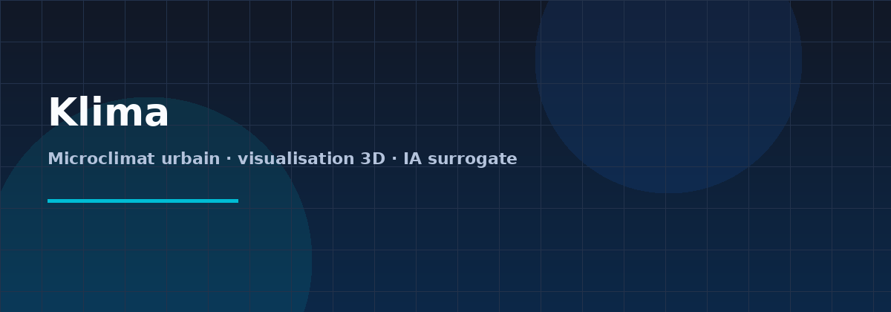
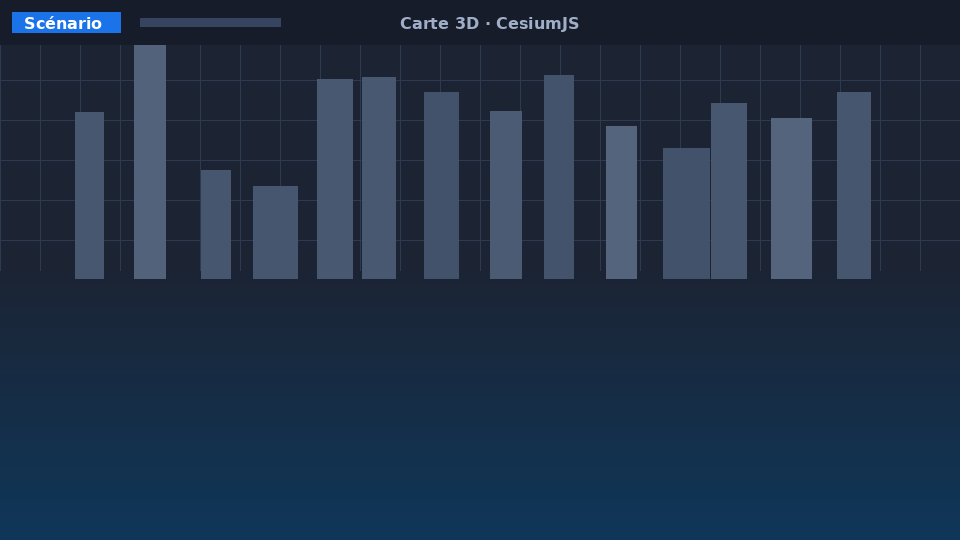
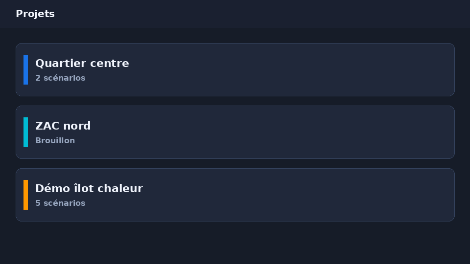

<div align="center">

# Klima

**Simulateur IA *surrogate* de microclimat urbain en 3D**

Visualisez et explorez l’impact thermique des aménagements (îlots de chaleur, flux d’air) via un modèle de substitution entraîné — une alternative rapide aux chaînes CFD classiques.

<br/>



<br/>

[](back/)
[](front/)
[](./scripts/run.sh)

</div>

---

> **Statut : phase de test et de recherche**  
> Klima est un **laboratoire logiciel** : l’API, l’interface et le pipeline modèle évoluent encore. Ce dépôt **ne constitue pas un produit fini** prêt pour la production. Les résultats de simulation peuvent être **indicatifs ou simulés** (données de secours sans modèle ONNX, comportements sujets à changement). Utilisez-le pour **expérimenter et contribuer**, pas comme référence métier figée.

---

## Aperçu

| Vue carte & scénario (illustration) | Projets & scénarios (illustration) |
| :---: | :---: |
|  |  |

Les images ci-dessus sont des **visuels de présentation** pour le README ; remplacez-les par de vraies captures depuis l’app en cours d’exécution — voir [`docs/screenshots/README.md`](docs/screenshots/README.md).

---

## En bref

- **Backend** : API Rust (Axum), inférence ONNX (`ort`), persistance PostgreSQL.  
- **Frontend** : Vue 3, Quasar, globe / scène 3D avec CesiumJS.  
- **IA** : approche type FNO / opérateurs neuronaux, export ONNX ; entraînement optionnel (Python, PyTorch, GPU).

---

## Stack technique

| Couche | Technologie |
|--------|-------------|
| Backend API & inférence | **Rust** — Axum, ONNX Runtime (`ort`), PostgreSQL |
| Modèle IA | Local-FNO (Fourier Neural Operator) + PINN, export ONNX |
| Frontend & 3D | **Vue.js 3** — Quasar, CesiumJS |
| Entraînement | Python, PyTorch, NVIDIA Modulus / neuraloperator |
| Dev | **Docker** + Docker Compose |

---

## Démarrage rapide

```bash
# Prérequis : Docker >= 24.0, Docker Compose >= 2.20

git clone git@github.com:Improba/klima.git
cd klima
./scripts/run.sh
```

| Service | URL |
|--------|-----|
| API (backend) | http://localhost:3000 |
| Interface web | http://localhost:9000 |

**Optionnel** : token Cesium Ion pour les bâtiments 3D Cesium OSM (`CESIUM_ION_TOKEN=… ./scripts/run.sh`, transmis au front comme `VITE_CESIUM_ION_TOKEN`). Sans token, la carte reste utilisable avec fond sombre et imagerie OpenStreetMap (pas de ciel étoilé par défaut).

---

## Structure du monorepo

```
klima/
├── back/           Rust / Axum — API + inférence ONNX + PostgreSQL
├── front/          Vue.js / Quasar / CesiumJS — interface 3D
├── docs/           Documentation + captures (screenshots)
├── scripts/        Orchestration Docker
└── README.md
```

---

## Commandes courantes

```bash
# Shell dans les conteneurs
docker exec -it klima-back  bash   # cargo, etc.
docker exec -it klima-front bash   # npm, quasar, etc.

# Cycle de vie
./scripts/run.sh              # Démarrer (dev)
./scripts/run.sh down         # Arrêter
./scripts/run.sh down -v      # Arrêter + volumes
./scripts/run.sh logs         # Logs
./scripts/run.sh restart      # Redémarrer
```

---

## Documentation

- [Spécification](docs/specification.md)
- [Architecture](docs/architecture.md)
- [Installation détaillée](docs/setup.md)

---

<div align="center">

*Klima — expérimentation microclimat urbain · Improba*

</div>
